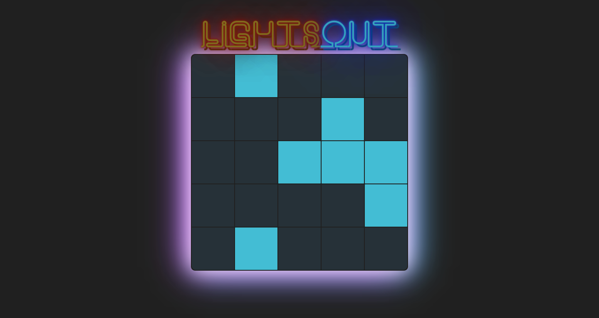

# LightsOut - Puzzle Game

[Lights Out](https://lightsoutofficial.netlify.com/) Lights Out is a logic/puzzle game, played on a gird of individual lights, which can either be lit or unlit. The puzzle is won when when all of the lights are turned off.



## Table of content

- [Description](#description)
- [Installation](#installation)
- [Contact](#contact)

## Description

Lights Out is a logic/puzzle game, played on a gird of individual lights, which can either be lit or unlit. The puzzle is won when when all of the lights are turned off.

You can click on a cell to toggle that light — but it also toggles the light above it, to the left of it, to the right of it, and below it. (Cells on an edge or in the corner won’t flip as many lights, since they are missing some neighbors).

## Installation

1. Clone the project to your local directory

```
git clone https://github.com/KaushikShivam/lights-out
```

2. The project uses NPM for managing dependencies. Run npm install to install all the required dependencies

```
npm install
```

3. Run the task runner to run the app

```
npm run start
```

## Contact

You can contact me at:

- [Portfolio](https://www.shivamkaushik.com)
- [Email](mailto:shivamkaushikofficial@gmail.com)
- [Linkedin](https://www.linkedin.com/in/kshivamdev/)
- [Twitter](https://twitter.com/kShivamDev)
- [Medium](https://medium.com/@shivamkaushikofficial)
- [Angellist](https://angel.co/kshivamdev)
